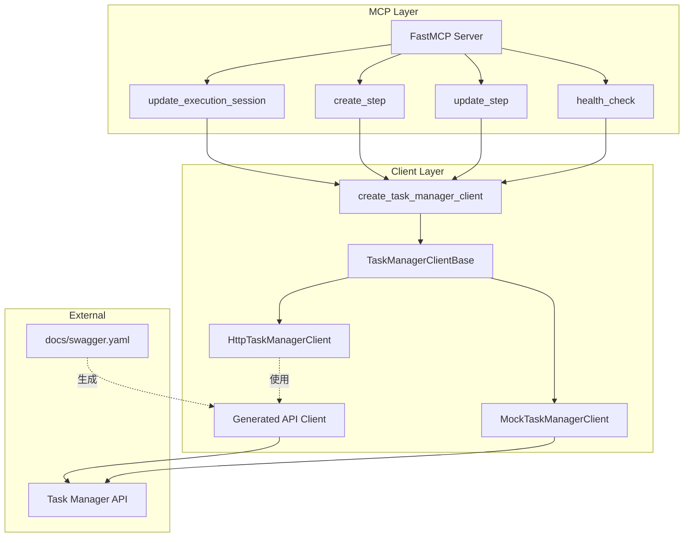

# 设计文档

## 概述

Nova Agent Sync MCP 服务器采用分层架构设计，将 MCP 工具层、客户端抽象层和具体实现层分离。通过策略模式实现客户端的可替换性，支持在生产环境使用 HTTP 客户端，在测试环境使用 Mock 客户端。

**重要说明：** 项目使用 `openapi-python-client` 从 `docs/swagger.yaml` 自动生成类型化的 API 客户端代码到 `src/clients/generated/` 目录。当 API 定义更新时，运行 `make regenerate` 重新生成客户端代码。

## 架构



### 层次说明

1. **MCP Layer**: 基于 fastmcp 框架的工具定义层，负责接收 Agent 调用并返回结果
2. **Client Layer**: 客户端抽象层，通过策略模式实现不同的后端通信方式
   - **Generated API Client**: 从 swagger.yaml 自动生成的类型化客户端（位于 `src/clients/generated/`）
   - **HttpTaskManagerClient**: 手写的 HTTP 客户端包装器，可选择性使用生成的客户端
   - **MockTaskManagerClient**: 用于测试的内存模拟客户端
3. **External**: 外部 Task Manager 服务和 API 定义

## 代码生成工作流

项目使用 `openapi-python-client` 工具从 OpenAPI/Swagger 规范自动生成 Python 客户端代码：

### 生成命令

```bash
# 重新生成客户端（清理 + 生成）
make regenerate

# 仅生成客户端
make generate

# 清理生成的代码
make clean
```

### 生成的文件结构

```
src/clients/generated/
├── _client/
│   ├── api/              # API 端点函数
│   │   ├── executions/   # Execution 相关 API
│   │   ├── steps/        # Step 相关 API
│   │   ├── health/       # 健康检查 API
│   │   └── ...
│   ├── models/           # 数据模型类
│   │   ├── http_create_step_request.py
│   │   ├── http_step_response.py
│   │   └── ...
│   ├── client.py         # 客户端基类
│   └── types.py          # 类型定义
├── README.md
└── pyproject.toml
```

### 使用生成的客户端

生成的客户端提供了类型安全的 API 调用接口。例如：

```python
from src.clients.generated._client.client import Client
from src.clients.generated._client.api.steps import post_api_executions_execution_id_steps
from src.clients.generated._client.models.http_create_step_request import HttpCreateStepRequest

# 创建客户端
client = Client(base_url="http://localhost:8080")

# 创建步骤请求
request = HttpCreateStepRequest(
    step_name="analyzing",
    message="Analyzing code",
    status="running"  # 可选
)

# 调用 API
response = post_api_executions_execution_id_steps.sync(
    execution_id="exec-123",
    client=client,
    body=request
)
```

### 更新 API 定义流程

1. 修改 `docs/swagger.yaml`
2. 运行 `make regenerate` 重新生成客户端
3. 更新 `HttpTaskManagerClient` 或其他使用生成客户端的代码（如需要）
4. 运行测试验证更改

### 层次说明（已更新）

1. **MCP Layer**: 基于 fastmcp 框架的工具定义层，负责接收 Agent 调用并返回结果
2. **Client Layer**: 客户端抽象层，通过策略模式实现不同的后端通信方式
3. **External**: 外部 Task Manager 服务

## 组件和接口

### MCP 工具模块 (src/server/mcp_tools.py)

工具描述中需要告知 Agent 可从环境变量 `NOVA_EXECUTION_ID` 获取 execution_id。

```python
@mcp.tool()
def update_execution_session(execution_id: str, session_id: str) -> Dict[str, Any]:
    """
    更新 execution 的 session_id。在开始时调用此工具注册会话。
    
    Args:
        execution_id: 执行 ID（可从环境变量 NOVA_EXECUTION_ID 获取）
        session_id: Agent 会话 ID（可通过 skill 工具获取）
    """
    pass

@mcp.tool()
def create_step(execution_id: str, step_name: str, message: Optional[str] = None, status: Optional[str] = None) -> Dict[str, Any]:
    """
    创建新步骤，返回 step_id。默认初始状态为 running。
    
    Args:
        execution_id: 执行 ID（可从环境变量 NOVA_EXECUTION_ID 获取）
        step_name: 步骤名称
        message: 可选的步骤描述
        status: 可选的初始状态 - running/completed/failed/skipped（默认：running）
    """
    pass

@mcp.tool()
def update_step(execution_id: str, step_id: str, status: Optional[str] = None, message: Optional[str] = None) -> Dict[str, Any]:
    """
    更新步骤状态和消息。
    
    Args:
        execution_id: 执行 ID（可从环境变量 NOVA_EXECUTION_ID 获取）
        step_id: 步骤 ID（从 create_step 返回）
        status: 新状态 - running/completed/failed/skipped
        message: 更新的消息
    """
    pass

@mcp.tool()
def health_check() -> Dict[str, Any]:
    """健康检查"""
    pass
```

### 客户端基类 (src/clients/base_client.py)

```python
class TaskManagerClientBase(ABC):
    @abstractmethod
    def patch_execution(self, execution_id: str, session_id: str) -> Dict[str, Any]:
        pass
    
    @abstractmethod
    def create_step(self, execution_id: str, step_name: str, message: Optional[str] = None, status: Optional[str] = None) -> Dict[str, Any]:
        pass
    
    @abstractmethod
    def patch_step(self, execution_id: str, step_id: str, status: Optional[str] = None, message: Optional[str] = None) -> Dict[str, Any]:
        pass
    
    @abstractmethod
    def health_check(self) -> Dict[str, Any]:
        pass
```

### 工厂方法 (src/clients/client_factory.py)

```python
def create_task_manager_client() -> TaskManagerClientBase:
    if os.getenv('USE_MOCK_CLIENT', 'false').lower() == 'true':
        return MockTaskManagerClient()
    return HttpTaskManagerClient()
```

## 数据模型

### StepStatus 枚举

```python
class StepStatus(Enum):
    RUNNING = "running"
    COMPLETED = "completed"
    FAILED = "failed"
    SKIPPED = "skipped"
```

### 请求/响应数据结构

```python
# 执行更新请求
@dataclass
class ExecutionPatch:
    session_id: Optional[str] = None
    worktree_path: Optional[str] = None

# 步骤创建请求
@dataclass
class StepCreate:
    step_name: str
    message: Optional[str] = None
    status: Optional[str] = None

# 步骤更新请求
@dataclass
class StepPatch:
    status: Optional[StepStatus] = None
    message: Optional[str] = None
```

### API 响应格式

所有 API 响应遵循统一格式：

```python
# 成功响应
{
    "success": True,
    "message": "操作描述",
    "data": { ... }  # 具体数据
}

# 失败响应
{
    "success": False,
    "error": "错误描述",
    "error_code": "ERROR_CODE"  # 可选
}
```

### API 端点映射

| 操作 | HTTP 方法 | 端点 |
|------|-----------|------|
| 更新 Execution | PATCH | /api/executions/{execution-id} |
| 创建 Step | POST | /api/executions/{execution-id}/steps |
| 更新 Step | PATCH | /api/executions/{execution-id}/steps/{step-id} |
| 健康检查 | GET | /api/health |


## 正确性属性

*正确性属性是一种在系统所有有效执行中都应保持为真的特征或行为——本质上是关于系统应该做什么的形式化陈述。属性作为人类可读规范和机器可验证正确性保证之间的桥梁。*

### Property 1: 响应格式一致性

*For any* MCP 工具调用，当操作成功时，响应 SHALL 包含 `success=True` 和 `data` 字段；当操作失败时，响应 SHALL 包含 `success=False` 和 `error` 字段。

**Validates: Requirements 1.2, 1.3, 2.2, 2.4, 3.6**

### Property 2: 状态值验证

*For any* 传入 update_step 工具的 status 参数，如果该值不在 {running, completed, failed, skipped} 集合中，则工具 SHALL 返回包含 `success=False` 的错误响应。

**Validates: Requirements 3.2, 3.3**

### Property 3: Mock 客户端状态一致性

*For any* 通过 Mock_Client 创建的步骤，后续对该步骤的更新操作 SHALL 反映在步骤状态中；对于不存在的步骤 ID，更新操作 SHALL 返回错误。

**Validates: Requirements 5.5**

### Property 4: 工厂方法选择正确性

*For any* USE_MOCK_CLIENT 环境变量值，当值为 "true"（不区分大小写）时，工厂方法 SHALL 返回 MockTaskManagerClient 实例；否则 SHALL 返回 HttpTaskManagerClient 实例。

**Validates: Requirements 5.1, 5.2, 5.3**

### Property 5: HTTP 错误响应处理

*For any* HTTP 响应状态码 >= 400，HTTP_Client SHALL 返回包含 `success=False`、`error` 和 `status_code` 字段的响应。

**Validates: Requirements 6.7**

### Property 6: 步骤创建初始状态

*For any* 通过 create_step 创建的步骤，如果未提供 status 参数，其初始状态 SHALL 为 "running"；如果提供了 status 参数，SHALL 使用提供的状态值。

**Validates: Requirements 2.1, 2.4, 2.5**

### Property 7: 参数传递完整性

*For any* 传入 MCP 工具的参数，客户端方法 SHALL 接收到相同的参数值（参数不丢失、不篡改）。

**Validates: Requirements 1.1, 2.3, 3.1, 3.5**

## 错误处理

### 错误类型

| 错误场景 | 错误响应 |
|---------|---------|
| 无效状态值（create_step） | `{"success": False, "error": "Invalid status '...'. Must be one of: running, completed, failed, skipped"}` |
| 无效状态值（update_step） | `{"success": False, "error": "Invalid status '...'. Must be one of: running, completed, failed, skipped"}` |
| 缺少必要参数 | `{"success": False, "error": "Provide at least status or message to update"}` |
| HTTP 超时 | `{"success": False, "error": "Request timeout"}` |
| 连接失败 | `{"success": False, "error": "Connection failed to {base_url}"}` |
| API 错误 (4xx/5xx) | `{"success": False, "error": "...", "error_code": "...", "status_code": ...}` |
| 步骤不存在 (Mock) | `{"success": False, "error": "Step {step_id} not found"}` |

### 异常处理策略

1. **MCP 工具层**: 捕获所有异常，转换为统一的错误响应格式
2. **HTTP 客户端层**: 捕获 httpx 异常（TimeoutException、ConnectError），转换为错误响应
3. **Mock 客户端层**: 验证数据存在性，返回适当的错误响应

## 测试策略

### 双重测试方法

本项目采用单元测试和属性测试相结合的方式：

- **单元测试**: 验证具体示例、边界条件和错误情况
- **属性测试**: 验证跨所有输入的通用属性

### 属性测试配置

- **测试框架**: pytest + hypothesis
- **最小迭代次数**: 每个属性测试 100 次
- **标签格式**: `Feature: agent-sync-mcp, Property {number}: {property_text}`

### 测试覆盖范围

| 测试类型 | 覆盖内容 |
|---------|---------|
| 单元测试 | MCP 工具参数验证、错误响应格式、数据模型结构 |
| 属性测试 | 响应格式一致性、状态值验证、工厂方法选择、Mock 客户端状态 |
| 集成测试 | HTTP 客户端与 Mock 服务器交互（可选） |

### 测试文件结构

```
tests/
├── test_mcp_tools.py          # MCP 工具单元测试
├── test_clients.py            # 客户端单元测试
├── test_models.py             # 数据模型测试
├── test_properties.py         # 属性测试
└── conftest.py                # pytest 配置和 fixtures
```
