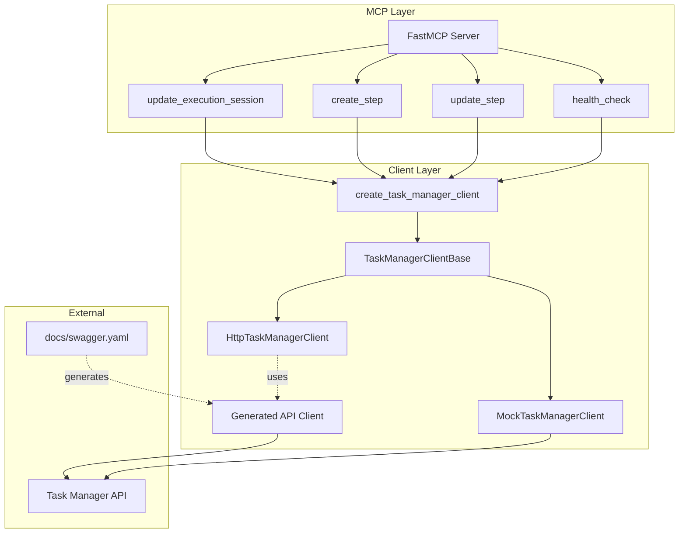

# Design Document

## Overview

Nova Task Manager MCP Server adopts a layered architecture design that separates the MCP tool layer, client abstraction layer, and concrete implementation layer. Through the strategy pattern, client replaceability is achieved, supporting HTTP client in production environments and Mock client in test environments.

**Important Note:** The project uses `openapi-python-client` to automatically generate typed API client code from `docs/swagger.yaml` to the `src/clients/generated/` directory. When the API definition is updated, run `make regenerate` to regenerate the client code.

## Architecture



### Layer Description

1. **MCP Layer**: Tool definition layer based on the fastmcp framework, responsible for receiving Agent calls and returning results
2. **Client Layer**: Client abstraction layer implementing different backend communication methods through the strategy pattern
   - **Generated API Client**: Typed client automatically generated from swagger.yaml (located in `src/clients/generated/`)
   - **HttpTaskManagerClient**: Hand-written HTTP client wrapper that optionally uses the generated client
   - **MockTaskManagerClient**: In-memory mock client for testing
3. **External**: External Task Manager service and API definition

## Code Generation Workflow

The project uses the `openapi-python-client` tool to automatically generate Python client code from OpenAPI/Swagger specifications:

### Generation Commands

```bash
# Regenerate client (clean + generate)
make regenerate

# Generate client only
make generate

# Clean generated code
make clean
```

### Generated File Structure

```
src/clients/generated/
├── _client/
│   ├── api/              # API endpoint functions
│   │   ├── executions/   # Execution-related APIs
│   │   ├── steps/        # Step-related APIs
│   │   ├── health/       # Health check API
│   │   └── ...
│   ├── models/           # Data model classes
│   │   ├── http_create_step_request.py
│   │   ├── http_step_response.py
│   │   └── ...
│   ├── client.py         # Client base class
│   └── types.py          # Type definitions
├── README.md
└── pyproject.toml
```

### Using the Generated Client

The generated client provides type-safe API call interfaces. For example:

```python
from src.clients.generated._client.client import Client
from src.clients.generated._client.api.steps import post_api_executions_execution_id_steps
from src.clients.generated._client.models.http_create_step_request import HttpCreateStepRequest

# Create client
client = Client(base_url="http://localhost:8080")

# Create step request
request = HttpCreateStepRequest(
    step_name="analyzing",
    message="Analyzing code",
    status="running"  # optional
)

# Call API
response = post_api_executions_execution_id_steps.sync(
    execution_id="exec-123",
    client=client,
    body=request
)
```

### API Definition Update Process

1. Modify `docs/swagger.yaml`
2. Run `make regenerate` to regenerate the client
3. Update `HttpTaskManagerClient` or other code using the generated client (if needed)
4. Run tests to verify changes

### Layer Description (Updated)

1. **MCP Layer**: Tool definition layer based on the fastmcp framework, responsible for receiving Agent calls and returning results
2. **Client Layer**: Client abstraction layer implementing different backend communication methods through the strategy pattern
3. **External**: External Task Manager service

## Components and Interfaces

### MCP Tools Module (src/server/mcp_tools.py)

Tool descriptions need to inform the Agent that execution_id can be retrieved from the `NOVA_EXECUTION_ID` environment variable.

```python
@mcp.tool()
def update_execution_session(execution_id: str, session_id: str) -> Dict[str, Any]:
    """
    Update the session_id of an execution. Call this tool at the start to register the session.
    
    Args:
        execution_id: Execution ID (can be retrieved from NOVA_EXECUTION_ID environment variable)
        session_id: Agent session ID (can be obtained through skill tool)
    """
    pass

@mcp.tool()
def create_step(execution_id: str, step_name: str, message: Optional[str] = None, status: Optional[str] = None) -> Dict[str, Any]:
    """
    Create a new step, returns step_id. Default initial status is running.
    
    Args:
        execution_id: Execution ID (can be retrieved from NOVA_EXECUTION_ID environment variable)
        step_name: Step name
        message: Optional step description
        status: Optional initial status - running/completed/failed/skipped (default: running)
    """
    pass

@mcp.tool()
def update_step(execution_id: str, step_id: str, status: Optional[str] = None, message: Optional[str] = None) -> Dict[str, Any]:
    """
    Update step status and message.
    
    Args:
        execution_id: Execution ID (can be retrieved from NOVA_EXECUTION_ID environment variable)
        step_id: Step ID (returned from create_step)
        status: New status - running/completed/failed/skipped
        message: Updated message
    """
    pass

@mcp.tool()
def health_check() -> Dict[str, Any]:
    """Health check"""
    pass
```

### 客户端基类 (src/clients/base_client.py)

```python
class TaskManagerClientBase(ABC):
    @abstractmethod
    def patch_execution(self, execution_id: str, session_id: str) -> Dict[str, Any]:
        pass
    
    @abstractmethod
    def create_step(self, execution_id: str, step_name: str, message: Optional[str] = None, status: Optional[str] = None) -> Dict[str, Any]:
        pass
    
    @abstractmethod
    def patch_step(self, execution_id: str, step_id: str, status: Optional[str] = None, message: Optional[str] = None) -> Dict[str, Any]:
        pass
    
    @abstractmethod
    def health_check(self) -> Dict[str, Any]:
        pass
```

### 工厂方法 (src/clients/client_factory.py)

```python
def create_task_manager_client() -> TaskManagerClientBase:
    if os.getenv('USE_MOCK_CLIENT', 'false').lower() == 'true':
        return MockTaskManagerClient()
    return HttpTaskManagerClient()
```

## Data Models

### StepStatus Enumeration

```python
class StepStatus(Enum):
    RUNNING = "running"
    COMPLETED = "completed"
    FAILED = "failed"
    SKIPPED = "skipped"
```

### Request/Response Data Structures

```python
# Execution update request
@dataclass
class ExecutionPatch:
    session_id: Optional[str] = None
    worktree_path: Optional[str] = None

# Step creation request
@dataclass
class StepCreate:
    step_name: str
    message: Optional[str] = None
    status: Optional[str] = None

# Step update request
@dataclass
class StepPatch:
    status: Optional[StepStatus] = None
    message: Optional[str] = None
```

### API Response Format

All API responses follow a unified format:

```python
# Success response
{
    "success": True,
    "message": "Operation description",
    "data": { ... }  # Specific data
}

# Failure response
{
    "success": False,
    "error": "Error description",
    "error_code": "ERROR_CODE"  # Optional
}
```

### API Endpoint Mapping

| Operation | HTTP Method | Endpoint |
|-----------|-------------|----------|
| Update Execution | PATCH | /api/executions/{execution-id} |
| Create Step | POST | /api/executions/{execution-id}/steps |
| Update Step | PATCH | /api/executions/{execution-id}/steps/{step-id} |
| Health Check | GET | /api/health |


## Correctness Properties

*Correctness properties are characteristics or behaviors that should remain true across all valid executions of a system—essentially formal statements about what the system should do. Properties serve as a bridge between human-readable specifications and machine-verifiable correctness guarantees.*

### Property 1: Response Format Consistency

*For any* MCP tool call, when the operation succeeds, the response SHALL contain `success=True` and a `data` field; when the operation fails, the response SHALL contain `success=False` and an `error` field.

**Validates: Requirements 1.2, 1.3, 2.2, 2.4, 3.6**

### Property 2: Status Value Validation

*For any* status parameter passed to the update_step tool, if the value is not in the set {running, completed, failed, skipped}, the tool SHALL return an error response containing `success=False`.

**Validates: Requirements 3.2, 3.3**

### Property 3: Mock Client State Consistency

*For any* step created through Mock_Client, subsequent update operations on that step SHALL be reflected in the step state; for non-existent step IDs, update operations SHALL return an error.

**Validates: Requirements 5.5**

### Property 4: Factory Method Selection Correctness

*For any* USE_MOCK_CLIENT environment variable value, when the value is "true" (case-insensitive), the factory method SHALL return a MockTaskManagerClient instance; otherwise SHALL return an HttpTaskManagerClient instance.

**Validates: Requirements 5.1, 5.2, 5.3**

### Property 5: HTTP Error Response Handling

*For any* HTTP response status code >= 400, HTTP_Client SHALL return a response containing `success=False`, `error`, and `status_code` fields.

**Validates: Requirements 6.7**

### Property 6: Step Creation Initial Status

*For any* step created through create_step, if no status parameter is provided, its initial status SHALL be "running"; if a status parameter is provided, SHALL use the provided status value.

**Validates: Requirements 2.1, 2.4, 2.5**

### Property 7: Parameter Passing Integrity

*For any* parameters passed to MCP tools, client methods SHALL receive the same parameter values (parameters not lost, not tampered with).

**Validates: Requirements 1.1, 2.3, 3.1, 3.5**

## Error Handling

### Error Types

| Error Scenario | Error Response |
|----------------|----------------|
| Invalid status value (create_step) | `{"success": False, "error": "Invalid status '...'. Must be one of: running, completed, failed, skipped"}` |
| Invalid status value (update_step) | `{"success": False, "error": "Invalid status '...'. Must be one of: running, completed, failed, skipped"}` |
| Missing required parameter | `{"success": False, "error": "Provide at least status or message to update"}` |
| HTTP timeout | `{"success": False, "error": "Request timeout"}` |
| Connection failure | `{"success": False, "error": "Connection failed to {base_url}"}` |
| API error (4xx/5xx) | `{"success": False, "error": "...", "error_code": "...", "status_code": ...}` |
| Step not found (Mock) | `{"success": False, "error": "Step {step_id} not found"}` |

### Exception Handling Strategy

1. **MCP Tool Layer**: Catch all exceptions, convert to unified error response format
2. **HTTP Client Layer**: Catch httpx exceptions (TimeoutException, ConnectError), convert to error responses
3. **Mock Client Layer**: Validate data existence, return appropriate error responses

## Testing Strategy

### Dual Testing Approach

This project combines unit testing and property testing:

- **Unit Tests**: Verify specific examples, boundary conditions, and error cases
- **Property Tests**: Verify general properties across all inputs

### Property Testing Configuration

- **Testing Framework**: pytest + hypothesis
- **Minimum Iterations**: 100 iterations per property test
- **Tag Format**: `Feature: task-manager-mcp, Property {number}: {property_text}`

### Test Coverage

| Test Type | Coverage |
|-----------|----------|
| Unit Tests | MCP tool parameter validation, error response format, data model structure |
| Property Tests | Response format consistency, status value validation, factory method selection, Mock client state |
| Integration Tests | HTTP client interaction with Mock server (optional) |

### Test File Structure

```
tests/
├── test_mcp_tools.py          # MCP tool unit tests
├── test_clients.py            # Client unit tests
├── test_models.py             # Data model tests
├── test_properties.py         # Property tests
└── conftest.py                # pytest configuration and fixtures
```
